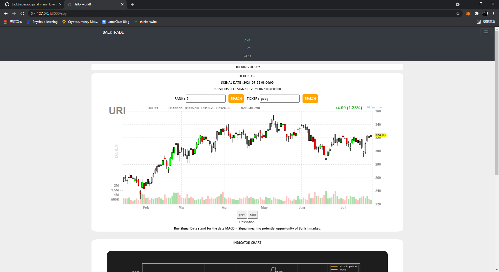

# BACKTRADED
### Using the Backtraded to find potential oppurtunity.
### Logic

1. Order the date that MACD > SIGNAL & MACD turn Positive

2. Golden cross & Death cross chart

### Scope
1. All the tickers are in the following fund
   ARKK ARKF ARKG ARKQ ARKW ARKX SPY QQQ

2. Technique Scanner follow the library
   https://mrjbq7.github.io/ta-lib/func_groups/pattern_recognition.html

   
3. TA-LIB
   https://www.lfd.uci.edu/~gohlke/pythonlibs/

### Operating:
Python main.py update data / Python app.py

### Views

