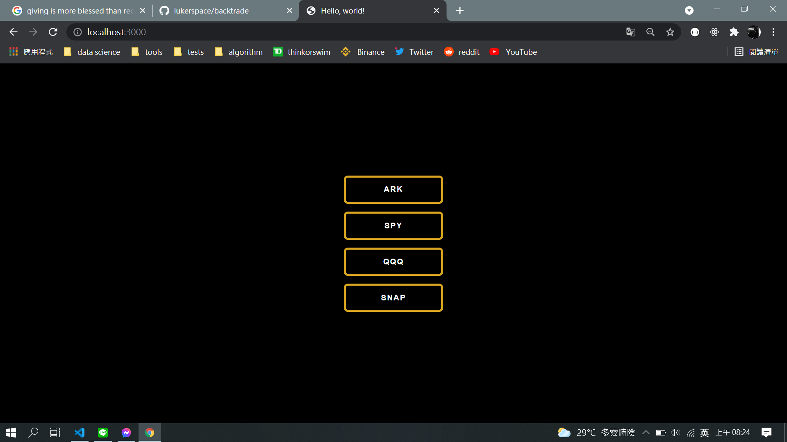

#BACKTRADED

USING BACKTRADING TO FIND THE POTENTIAL BULLISH MARKET.

1. TICKERS INCLUDE THE FOLLOWING FUND
   ARKK ARKF ARKG ARKQ ARKW ARKX
   SPY
   QQQ

2. Technique Scanner follow the library
   https://mrjbq7.github.io/ta-lib/func_groups/pattern_recognition.html

#Operating:

run main.py update data / run app.py

